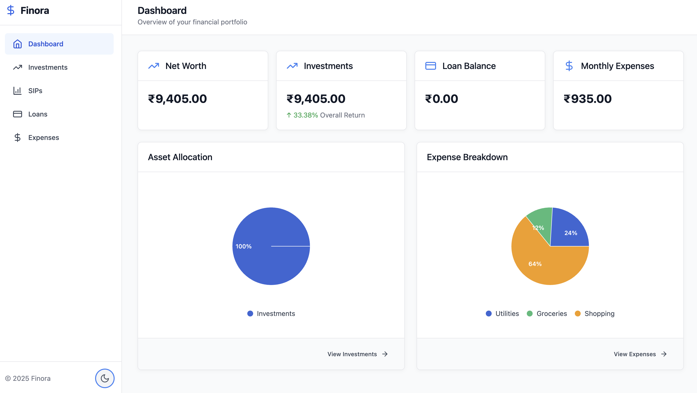
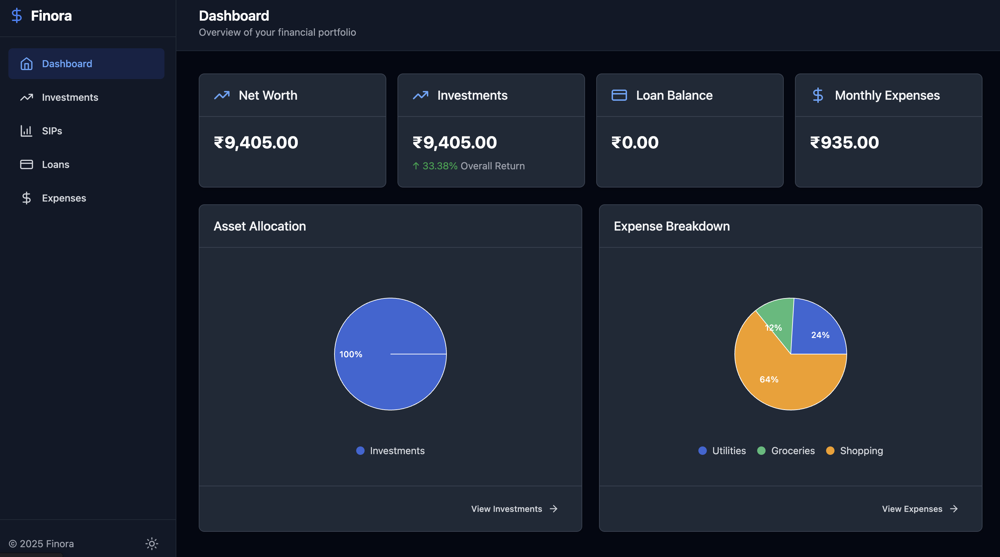
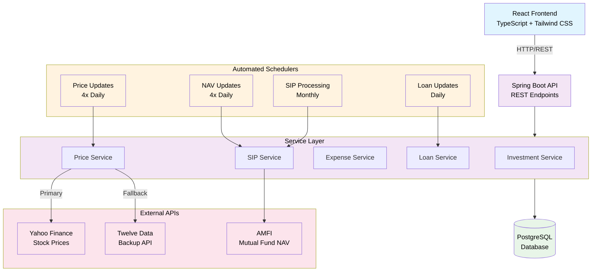

# Finance Tracker

A full-stack personal finance management application with real-time market data integration, automated portfolio tracking, and comprehensive financial analytics.

## 📸 Screenshots

### Dashboard - Light Mode


### Dashboard - Dark Mode


The dashboard provides a comprehensive overview of your financial portfolio with:
- **Net Worth Tracking**: Real-time portfolio valuation
- **Investment Performance**: Overall return percentage with automated price updates
- **Loan Management**: Outstanding loan balance tracking
- **Expense Monitoring**: Monthly spending summary
- **Asset Allocation Chart**: Visual breakdown of investment distribution
- **Expense Analytics**: Categorized spending visualization (Utilities, Groceries, Shopping)
- **Quick Navigation**: Direct links to detailed views for investments and expenses

## 🚀 Quick Start with Docker (Recommended)

The easiest way to run the entire application is using Docker Compose. All services (database, backend, frontend) will be started automatically.

### Prerequisites

- Docker Desktop installed and running
- Docker Compose (included with Docker Desktop)

### Starting the Application

**Linux/macOS:**
```bash
./run.sh
```

**Windows:**
```cmd
run.bat
```

**Manual Start:**
```bash
docker compose up --build
```

### Access Points

Once started, access the application at:

- **Frontend**: http://localhost
- **Backend API**: http://localhost:8080/api
- **API Documentation (Swagger)**: http://localhost:8080/swagger-ui.html
- **Health Check**: http://localhost:8080/actuator/health
- **Database**: localhost:5432 (for external tools)

### What Gets Started

1. **PostgreSQL Database** (port 5432)
   - Database: `finance_tracker`
   - User: `postgres`
   - Password: `postgres`
   - Data persisted in Docker volume

2. **Spring Boot Backend** (port 8080)
   - REST API endpoints
   - Automated schedulers for price updates
   - Swagger UI for API documentation

3. **React Frontend** (port 80)
   - Served via NGINX
   - Modern UI with real-time data

### Stopping Services

Press `Ctrl+C` in the terminal, or run:
```bash
docker compose down
```

To remove volumes (⚠️ WARNING: deletes all data):
```bash
docker compose down -v
```

## 🏗️ System Architecture



## ✨ Key Features

- **Real-time Portfolio Tracking**: Automated price updates 4 times daily
- **SIP Management**: Monthly automated investment processing with NAV tracking
- **Expense Analytics**: Categorized spending analysis with visualizations
- **Loan Calculator**: EMI tracking with automatic balance updates
- **Data Export**: PDF/Excel report generation
- **API Failover**: Dual API integration for high reliability
- **Smart Scheduling**: Configurable cron jobs for different market timings

## 🛠️ Tech Stack

**Backend**: 
- Spring Boot 3.4.5
- Java 21
- PostgreSQL
- Spring Data JPA
- Maven

**Frontend**: 
- React 18
- TypeScript
- Vite
- Tailwind CSS
- Recharts

**External APIs**: 
- Yahoo Finance (stocks)
- AMFI (mutual funds)
- Twelve Data (backup)

## 💻 Local Development Setup

If you prefer to run the application without Docker:

### Prerequisites

- Java 21+
- Node.js (LTS version)
- Maven 3.6+
- PostgreSQL

### Backend Setup

```bash
git clone <repository-url>
cd Finance_Tracker-API

# Configure application.properties
spring.datasource.url=jdbc:postgresql://localhost:5432/finance_tracker
spring.datasource.username=your_username
spring.datasource.password=your_password
twelvedata.api.key=your_api_key_here  # Optional

# Run the application
./mvnw spring-boot:run  # Starts on port 8080
```

### Frontend Setup

```bash
cd Finance_Tracker-UI
npm install
npm run dev  # Starts on port 5173
```

## 📡 API Endpoints

| Endpoint | Method | Description |
|----------|--------|-------------|
| `/api/investments` | GET/POST | Portfolio management |
| `/api/investments/summary` | GET | Portfolio overview |
| `/api/sips` | GET/POST | SIP tracking |
| `/api/expenses` | GET/POST | Expense management |
| `/api/loans` | GET/POST | Loan calculations |

**Full API Documentation**: Interactive API documentation is available via Swagger UI:
- http://localhost:8080/swagger-ui.html

## ⏰ Automated Schedulers

The application includes automated background tasks:

```java
@Scheduled(cron = "0 0 9,12,15,18 * * *")  // Price Updates (9 AM, 12 PM, 3 PM, 6 PM)
@Scheduled(cron = "0 0 9 1 * *")           // Monthly SIP Processing (1st of month, 9 AM)
@Scheduled(cron = "0 0 0 * * *")           // Daily Loan Updates (Midnight)
```

## 🔌 External API Integration

**Yahoo Finance**: 
- Real-time stock prices with automatic symbol formatting
- Example: RELIANCE → RELIANCE.NS (NSE) or RELIANCE.BO (BSE)
- 10-second rate limiting between requests

**AMFI**: 
- Official mutual fund NAV data
- Daily CSV parsing for accurate pricing
- Caching for improved performance

**Twelve Data**: 
- Backup API with NSE/BSE support
- 8-second rate limiting
- Exponential backoff for failures

## 🐳 Docker Configuration

### Environment Variables

The backend uses environment variables configured in `docker-compose.yml`:

- `SPRING_DATASOURCE_URL`: PostgreSQL connection URL
- `SPRING_DATASOURCE_USERNAME`: Database username
- `SPRING_DATASOURCE_PASSWORD`: Database password
- `SERVER_PORT`: Backend port (8080)
- `VITE_API_BASE_URL`: Frontend API connection URL

### Data Persistence

PostgreSQL data is stored in a Docker volume named `postgres_data`. This persists even after containers are stopped.

**Backup Database:**
```bash
docker compose exec postgres pg_dump -U postgres finance_tracker > backup.sql
```

**Restore Database:**
```bash
docker compose exec -T postgres psql -U postgres finance_tracker < backup.sql
```

### View Logs

```bash
# All services
docker compose logs -f

# Specific service
docker compose logs -f backend
docker compose logs -f frontend
docker compose logs -f postgres
```

### Rebuild After Code Changes

```bash
docker compose up --build
```

## 🔧 Troubleshooting

### Port Already in Use

If ports 80, 8080, or 5432 are already in use, modify the port mappings in `docker-compose.yml`:

```yaml
services:
  frontend:
    ports:
      - "3000:80"  # Change 80 to your preferred port
```

### Database Connection Issues

Ensure PostgreSQL container is healthy before backend starts. Health checks are configured automatically in `docker-compose.yml`.

### Frontend Can't Connect to Backend

1. Verify backend is running: http://localhost:8080/actuator/health
2. Check browser console for CORS errors
3. Verify `VITE_API_BASE_URL` in docker-compose.yml

### Application Not Starting

```bash
# Check container status
docker compose ps

# View detailed logs
docker compose logs

# Restart services
docker compose restart
```

## 🚀 Production Build

### Using Docker (Recommended)

```bash
docker compose up --build -d
```

### Manual Build

**Backend:**
```bash
cd Finance_Tracker-API
./mvnw clean package
java -jar target/finance-tracker-0.0.1-SNAPSHOT.jar
```

**Frontend:**
```bash
cd Finance_Tracker-UI
npm run build
# Serve dist/ folder with a web server (nginx, apache, etc.)
```

## ⚙️ Configuration

**Development**: H2 in-memory database  
**Production**: PostgreSQL with connection pooling  
**Scheduling**: Configurable cron expressions for different market timings  
**Rate Limiting**: 10s delays for Yahoo Finance, 8s for Twelve Data

## ⚡ Performance Features

- API response caching for NAV data
- Batch processing for portfolio updates
- Database indexing for optimized queries
- Connection pooling for efficient database access
- Exponential backoff for API failures
- Automatic retry mechanisms for failed requests

## 📊 Database Schema

The application uses PostgreSQL with the following main entities:

- **Investments**: Stock and mutual fund holdings
- **SIPs**: Systematic Investment Plans
- **Expenses**: Categorized spending records
- **Loans**: EMI and loan tracking
- **Price History**: Historical price data for analytics

## 🔒 Security Considerations

- Environment variables for sensitive configuration
- CORS configuration for API access
- Database credentials stored in docker-compose.yml (change for production)
- API rate limiting to prevent abuse

## 📝 License

MIT License - Built for better financial management and investment tracking

## 🤝 Contributing

Contributions are welcome! Please feel free to submit a Pull Request.

## 📧 Support

For issues, questions, or feature requests, please open an issue on the repository.