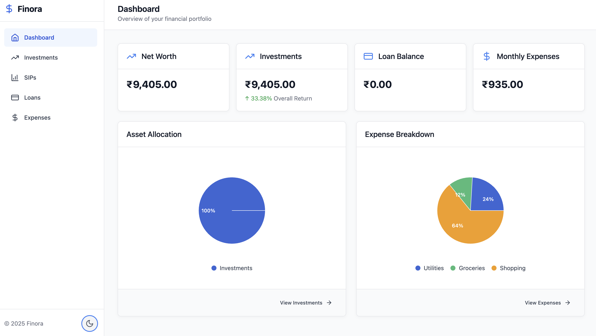
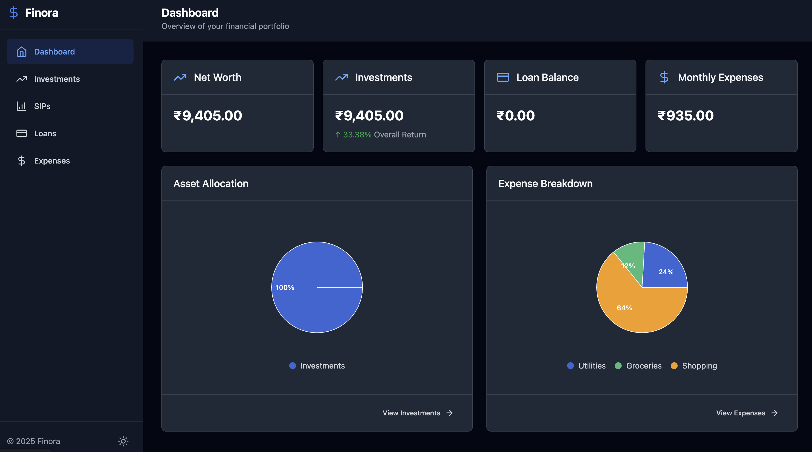
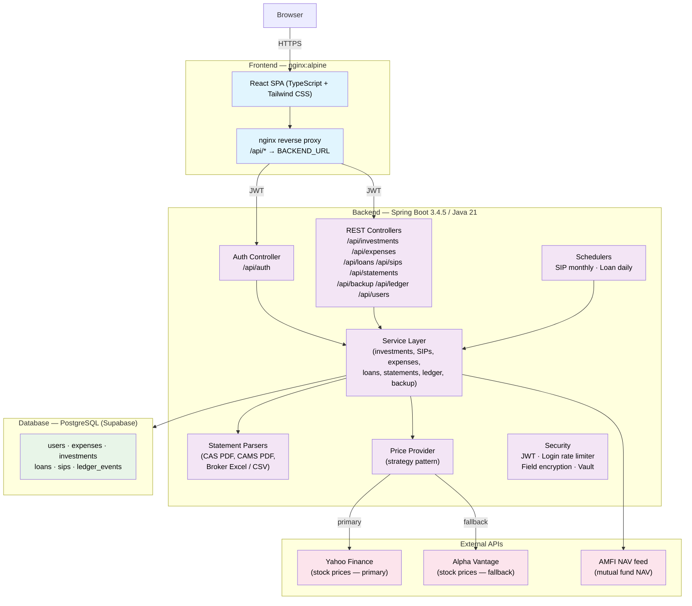
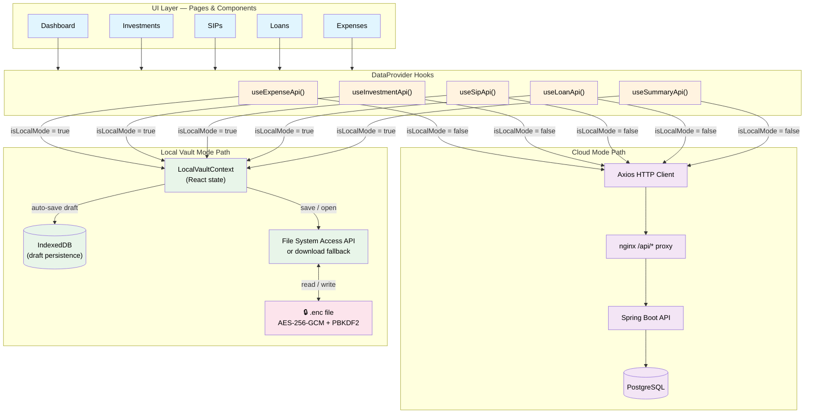

# Finora - Personal Finance Tracker

A full-stack personal finance management application for tracking investments, mutual funds, loans, SIPs, and expenses. Features statement import from broker and CAMS/CAS PDFs, a tamper-evident audit ledger, optional client-side data encryption via a personal vault, encrypted backup/restore, and an **offline-first local vault mode** that keeps all data in an AES-256-GCM encrypted file on your device — no account or server required.

**Live application:** https://finora-financetracker.up.railway.app/

---

## Screenshots

### Dashboard - Light Mode


### Dashboard - Dark Mode


---

## Deployment

The application is deployed on Railway with the following services:

| Service | Platform | URL |
|---|---|---|
| Frontend | Railway (nginx:alpine container) | https://finora-financetracker.up.railway.app |
| Backend API | Railway (Java 21 container) | https://finora-api.up.railway.app |
| Database | Supabase (PostgreSQL 17) | Managed, not public |

The frontend nginx container proxies all `/api/*` requests to the backend using the `BACKEND_URL` environment variable, so the browser never makes cross-origin requests directly.

---

## Quick Start with Docker (Local Development)

### Prerequisites

- Docker Desktop installed and running

### Start

```bash
docker compose up --build
```

### Access

| Service | URL |
|---|---|
| Frontend | http://localhost |
| Backend API | http://localhost:8082/api |
| API docs (Swagger) | http://localhost:8082/swagger-ui.html |
| Health check | http://localhost:8082/actuator/health |

### What Gets Started

1. **PostgreSQL** (host port 5433 mapped to container 5432) — database `finance_tracker`, persisted in a Docker volume
2. **Spring Boot API** (port 8082) — REST API with JWT authentication, Flyway migrations, and scheduled background tasks
3. **React Frontend** (port 80) — served via nginx, proxies `/api/*` to the backend

### Stop

```bash
docker compose down
```

To also delete all data:

```bash
docker compose down -v
```

---

## System Architecture


```mermaid
graph TB
    Browser["Browser"]

    subgraph Frontend["Frontend — nginx:alpine"]
        SPA["React SPA (TypeScript + Tailwind CSS)"]
        Proxy["nginx reverse proxy\n/api/* → BACKEND_URL"]
    end

    subgraph Backend["Backend — Spring Boot 3.4.5 / Java 21"]
        Auth["Auth Controller\n/api/auth"]
        API["REST Controllers\n/api/investments /api/expenses\n/api/loans /api/sips /api/statements\n/api/backup /api/ledger /api/users"]
        Services["Service Layer\n(investments, SIPs, expenses,\nloans, statements, ledger, backup)"]
        Parsers["Statement Parsers\n(CAS PDF, CAMS PDF,\nBroker Excel / CSV)"]
        Prices["Price Provider\n(strategy pattern)"]
        Schedulers["Schedulers\nSIP monthly · Loan daily"]
        Security["Security\nJWT · Login rate limiter\nField encryption · Vault"]
    end

    subgraph DB["Database — PostgreSQL (Supabase)"]
        Tables["users · expenses · investments\nloans · sips · ledger_events"]
    end

    subgraph External["External APIs"]
        YF["Yahoo Finance\n(stock prices — primary)"]
        AV["Alpha Vantage\n(stock prices — fallback)"]
        AMFI["AMFI NAV feed\n(mutual fund NAV)"]
    end

    Browser -->|HTTPS| SPA
    SPA --> Proxy
    Proxy -->|JWT| Auth
    Proxy -->|JWT| API
    Auth --> Services
    API --> Services
    Services --> Parsers
    Services --> Prices
    Services --> DB
    Schedulers --> Services
    Prices -->|primary| YF
    Prices -->|fallback| AV
    Services --> AMFI

    classDef fe fill:#e1f5fe,color:#000
    classDef be fill:#f3e5f5,color:#000
    classDef db fill:#e8f5e8,color:#000
    classDef ext fill:#fce4ec,color:#000

    class SPA,Proxy fe
    class Auth,API,Services,Parsers,Prices,Schedulers,Security be
    class Tables db
    class YF,AV,AMFI ext
```

### Frontend

React 18 with TypeScript, built with Vite and styled with Tailwind CSS. Served as a static SPA from nginx. In cloud mode, all API calls go through the nginx proxy at `/api/`. In local vault mode, the same UI operates entirely in the browser with no network requests.

### Dual-Mode Data Flow

The frontend uses a **DataProvider abstraction layer** so every page works identically in both modes. Each domain has a React hook (e.g. `useExpenseApi()`) that returns either the real REST client or an in-memory local implementation — pages never know which mode is active.


```mermaid
flowchart TB
    subgraph UI["UI Layer — Pages & Components"]
        Dashboard[Dashboard]
        Investments[Investments]
        SIPs[SIPs]
        Loans[Loans]
        Expenses[Expenses]
    end

    subgraph Hooks["DataProvider Hooks"]
        useExpenseApi["useExpenseApi()"]
        useInvestmentApi["useInvestmentApi()"]
        useSipApi["useSipApi()"]
        useLoanApi["useLoanApi()"]
        useSummaryApi["useSummaryApi()"]
    end

    subgraph Cloud["Cloud Mode Path"]
        AxiosClient["Axios HTTP Client"]
        NginxProxy["nginx /api/* proxy"]
        SpringBoot["Spring Boot API"]
        PostgreSQL[(PostgreSQL)]
    end

    subgraph Local["Local Vault Mode Path"]
        VaultCtx["LocalVaultContext\n(React state)"]
        IDB[("IndexedDB\n(draft persistence)")]
        FSA["File System Access API\nor download fallback"]
        EncFile["🔒 .enc file\nAES-256-GCM + PBKDF2"]
    end

    Dashboard & Investments & SIPs & Loans & Expenses --> Hooks

    useExpenseApi & useInvestmentApi & useSipApi & useLoanApi & useSummaryApi -->|"isLocalMode = false"| AxiosClient
    useExpenseApi & useInvestmentApi & useSipApi & useLoanApi & useSummaryApi -->|"isLocalMode = true"| VaultCtx

    AxiosClient --> NginxProxy --> SpringBoot --> PostgreSQL

    VaultCtx -->|auto-save draft| IDB
    VaultCtx -->|save / open| FSA
    FSA <-->|read / write| EncFile

    classDef ui fill:#e1f5fe,color:#000
    classDef hook fill:#fff3e0,color:#000
    classDef cloud fill:#f3e5f5,color:#000
    classDef local fill:#e8f5e9,color:#000
    classDef file fill:#fce4ec,color:#000

    class Dashboard,Investments,SIPs,Loans,Expenses ui
    class useExpenseApi,useInvestmentApi,useSipApi,useLoanApi,useSummaryApi hook
    class AxiosClient,NginxProxy,SpringBoot,PostgreSQL cloud
    class VaultCtx,IDB,FSA local
    class EncFile file
```

### Backend

Spring Boot 3.4.5 on Java 21. Organized into:

- **Controllers** — REST endpoints under `/api/*`, all protected by JWT except `/api/auth/register` and `/api/auth/login`
- **Services** — business logic for each domain (investments, SIPs, expenses, loans, users, statements, ledger, backup)
- **Statement parsers** — CAS PDF parser, CAMS PDF parser, and a broker Excel/CSV parser that auto-detects column layout
- **Price providers** — strategy pattern with Yahoo Finance as primary and Alpha Vantage as fallback
- **Schedulers** — SIP monthly processing (1st of each month, 9 AM) and loan balance updates (daily, midnight)
- **Ledger service** — append-only, hash-chained audit log of every create/update/delete written to `ledger_events`
- **Backup service** — AES-256-GCM encrypted full-data export and import with ledger chain integrity verification
- **Field encryption** — optional AES-256-GCM column-level encryption for sensitive fields (name, description, email), controlled by `FIELD_ENCRYPTION_KEY`
- **Vault** — optional user-held passphrase that adds a second encryption layer on top of field encryption

### Database

PostgreSQL managed by Flyway migrations:

- `V1__init.sql` — all tables with `IF NOT EXISTS` (idempotent)

Tables: `users`, `expenses`, `investments`, `loans`, `sips`, `ledger_events`

---

## Features

**Portfolio management**
- Stocks, ETFs, bonds, and mutual funds in one place
- Import holdings directly from broker Excel/CSV exports (Zerodha, Groww, Upstox, HDFC, ICICI, Angel, 5paisa, Kotak, Sharekhan, and others that follow a standard column layout)
- Import from CAMS and CAS (Consolidated Account Statement) PDFs
- Two-step preview and confirm import flow — select which holdings to import, skip manual entries

**Automated price updates**
- Stock and ETF prices fetched from Yahoo Finance on demand; Alpha Vantage used as fallback when configured
- Mutual fund NAV pulled from the official AMFI daily feed (amfiindia.com) and cached in-memory

**SIP tracking**
- Monthly SIP installment processing runs automatically on the 1st of each month
- Links SIP records to their corresponding investment holding when imported from a statement

**Expenses**
- Categorized expense entries with payment method tracking
- Monthly spending trend and category breakdown charts

**Loans**
- Simple and compound interest support with configurable compounding frequency
- Daily loan balance recalculation
- EMI tracking and remaining tenure display

**Audit ledger**
- Every create, update, and delete on investments, expenses, loans, and SIPs is written to an append-only `ledger_events` table
- Events are SHA-256 hash-chained (each event includes the hash of the previous event) — any tampering breaks the chain
- Integrity can be verified at any time from the API

**Vault (optional)**
- Users can enable a personal vault with a passphrase (minimum 8 characters)
- The passphrase derives an additional AES-256-GCM key that wraps field-level encryption
- Without the passphrase, encrypted data cannot be read even with database access
- Passphrase is never stored — loss of passphrase means permanent loss of access to encrypted records

**Backup and restore**
- Full data export encrypted with AES-256-GCM using a password chosen at export time
- Backup file includes the ledger event chain; integrity is verified before import
- Restoring a backup replaces all existing data for the user

**Excel reports**
- Per-section Excel exports for investments, expenses, loans, and SIPs

**Local vault mode (offline)**
- No account or server connection required — works entirely in the browser
- All data stored in a single AES-256-GCM encrypted `.enc` file on your device
- Encryption uses PBKDF2 key derivation (310,000 iterations) from a user-chosen passphrase
- Draft changes auto-persist to IndexedDB so nothing is lost if the tab closes
- Save vault uses the File System Access API (Chrome/Edge) for in-place file writes, with a download fallback for Firefox/Safari
- Cloud backups can be opened as local vaults and vice versa
- Server-only features (statement import, price refresh, NAV refresh) are automatically hidden in local mode
- Landing page at `/welcome` lets users choose between Cloud Mode and Local Vault

**Global search**
- Keyboard-accessible search across all investments, expenses, loans, and SIPs

---

## API Endpoints

### Authentication

| Method | Endpoint | Description |
|---|---|---|
| POST | `/api/auth/register` | Register a new account (email + username + password) |
| POST | `/api/auth/login` | Login with email and password, returns JWT |

### Finance data

| Method | Endpoint | Description |
|---|---|---|
| GET/POST | `/api/investments` | List all / create investment |
| PUT/DELETE | `/api/investments/{id}` | Update / delete investment |
| POST | `/api/investments/refresh-prices` | Trigger on-demand price refresh |
| GET/POST | `/api/expenses` | List all / create expense |
| PUT/DELETE | `/api/expenses/{id}` | Update / delete expense |
| GET/POST | `/api/loans` | List all / create loan |
| PUT/DELETE | `/api/loans/{id}` | Update / delete loan |
| GET/POST | `/api/sips` | List all / create SIP |
| PUT/DELETE | `/api/sips/{id}` | Update / delete SIP |
| GET | `/api/finance-summary` | Aggregated dashboard summary |

### Statement import

| Method | Endpoint | Description |
|---|---|---|
| POST | `/api/statements/preview` | Upload file, get parsed holdings preview |
| POST | `/api/statements/confirm` | Confirm selected holdings for import |

### User and vault

| Method | Endpoint | Description |
|---|---|---|
| GET | `/api/users/me` | Get current user profile |
| PATCH | `/api/users/me` | Update username |
| GET | `/api/users/vault/status` | Check whether vault is enabled |
| POST | `/api/users/vault/enable` | Enable vault with a passphrase |
| POST | `/api/users/vault/disable` | Disable vault |

### Backup

| Method | Endpoint | Description |
|---|---|---|
| POST | `/api/backup/export` | Download encrypted backup file |
| POST | `/api/backup/import` | Upload and restore from backup |

### Ledger

| Method | Endpoint | Description |
|---|---|---|
| GET | `/api/ledger/verify` | Verify hash chain integrity for current user |
| GET | `/api/ledger/entity/{type}/{id}` | Get audit timeline for a specific record |

All endpoints except `/api/auth/register` and `/api/auth/login` require a JWT in the Authorization header:

```
Authorization: Bearer <token>
```

---

## Tech Stack

**Backend**
- Java 21
- Spring Boot 3.4.5
- Spring Security (JWT, login rate limiter — 5 attempts per minute per IP)
- Spring Data JPA + Hibernate 6
- Flyway (database migrations)
- PostgreSQL
- Apache PDFBox 3 (CAS and CAMS PDF parsing)
- Apache POI 5 (broker Excel parsing)
- Maven

**Frontend**
- React 18
- TypeScript
- Vite
- Tailwind CSS
- Recharts (charts)
- SheetJS/xlsx (Excel report generation)
- React Router

**Infrastructure**
- Railway (container hosting for API and frontend)
- Supabase (managed PostgreSQL)
- nginx:alpine (frontend serving and API reverse proxy)
- Docker / Docker Compose (local development)

**External APIs**
- Yahoo Finance — stock and ETF prices (no key required)
- Alpha Vantage — stock price fallback (requires `ALPHAVANTAGE_API_KEY`)
- AMFI (amfiindia.com) — mutual fund NAV daily feed

---

## Local Development Setup

### Prerequisites

- Java 21 or later
- Node.js LTS
- Maven 3.6 or later
- PostgreSQL (or use Docker Compose which sets this up automatically)

### Backend

```bash
cd Finora-API

# Create .env with required variables
cat > .env <<EOF
JWT_SECRET=your_jwt_secret_minimum_32_characters
DB_HOST=localhost
DB_PORT=5432
DB_NAME=finora
DB_USERNAME=postgres
DB_PASSWORD=postgres
CORS_ALLOWED_ORIGINS=http://localhost,http://localhost:5173
# Optional
ALPHAVANTAGE_API_KEY=your_key
FIELD_ENCRYPTION_KEY=your_encryption_key
EOF

./mvnw spring-boot:run
# API starts on port 8080 (or PORT env var)
```

### Frontend

```bash
cd Finora-UI

npm install
npm run dev
# Dev server starts on port 5173
# Vite proxies /api/* to http://localhost:8080
```

---

## Environment Variables

### Backend (Railway / .env)

| Variable | Required | Description |
|---|---|---|
| `JWT_SECRET` | Yes | Secret key for signing JWT tokens (minimum 32 characters) |
| `DATABASE_URL` | Railway | Full JDBC URL (overrides individual DB_ vars) |
| `DB_HOST` | Local | PostgreSQL host |
| `DB_PORT` | Local | PostgreSQL port |
| `DB_NAME` | Local | Database name |
| `DB_USERNAME` | Local | Database user |
| `DB_PASSWORD` | Local | Database password |
| `CORS_ALLOWED_ORIGINS` | Yes | Comma-separated list of allowed frontend origins |
| `ALPHAVANTAGE_API_KEY` | No | Alpha Vantage key for stock price fallback |
| `FIELD_ENCRYPTION_KEY` | No | Enables AES-256-GCM column-level encryption when set |
| `PORT` | Auto | Injected by Railway; defaults to 8080 |

### Frontend (Railway)

| Variable | Description |
|---|---|
| `BACKEND_URL` | Full URL of the backend service (e.g. `https://finora-api.up.railway.app`) |
| `PORT` | Injected by Railway; nginx listens on this port |

---

## Automated Schedulers

| Schedule | Task |
|---|---|
| 1st of every month, 9:00 AM | Process monthly SIP installments — deducts monthly amount from each active SIP, updates unit count using current NAV |
| Every day, midnight | Recalculate loan balances and remaining tenure |

Stock price updates are triggered on demand (via the refresh-prices endpoint or from the investments page) rather than on a fixed schedule.

---

## Security Notes

- JWT tokens are signed with HMAC-SHA256 using `JWT_SECRET`
- Login is rate-limited to 5 attempts per minute per IP address
- Field-level encryption uses AES-256-GCM with PBKDF2 key derivation (310,000 iterations)
- The vault adds a second AES-256-GCM encryption layer keyed from the user's passphrase — the passphrase is never stored anywhere
- Local vault mode uses client-side AES-256-GCM (WebCrypto API) with PBKDF2 (310,000 iterations, SHA-256) — encryption and decryption happen entirely in the browser; the passphrase never leaves the device
- The ledger is protected by an append-only trigger in PostgreSQL; events cannot be updated or deleted at the database level
- Sensitive fields (investment names, expense descriptions, user email) are encrypted at rest when `FIELD_ENCRYPTION_KEY` is configured

---

## Database Schema

| Table | Purpose |
|---|---|
| `users` | Accounts, roles, vault configuration |
| `investments` | Stock, ETF, bond, and mutual fund holdings |
| `expenses` | Categorized expense records |
| `loans` | Loan records with EMI and interest type |
| `sips` | SIP configurations and unit tracking |
| `ledger_events` | Append-only hash-chained audit log |

---

## License

MIT
